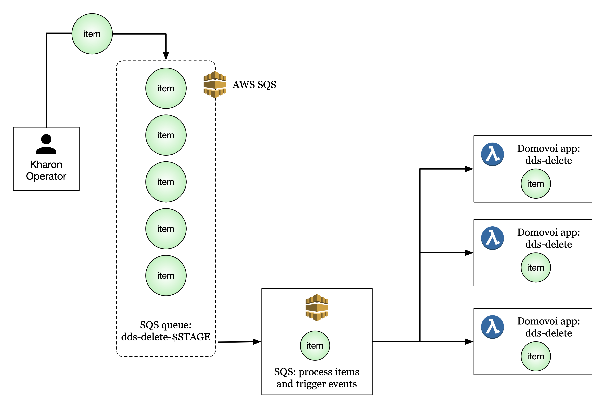
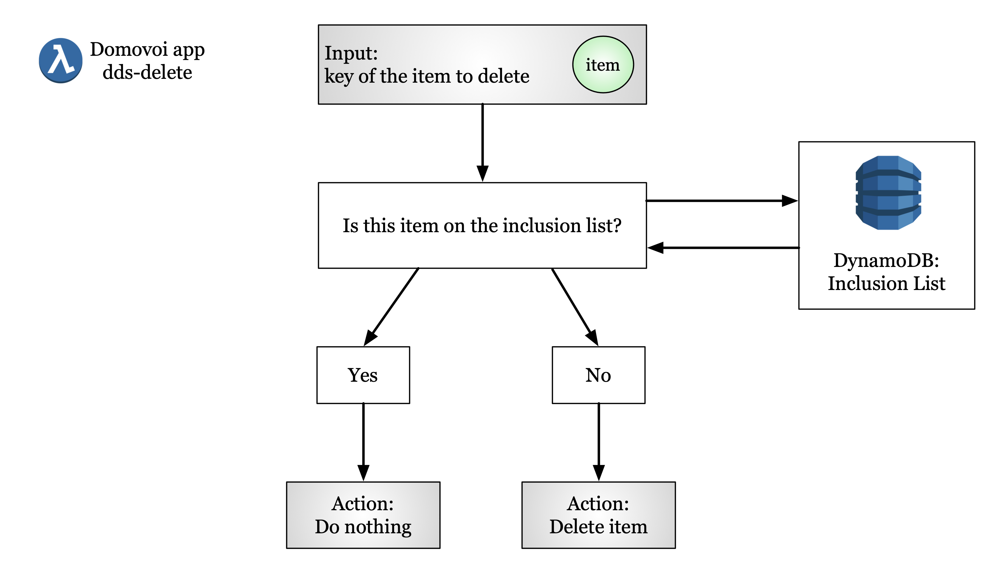

Kharon Cloud Architecture
----------------------------

### Deletion Queue

The central idea behind Kharon is the deletion queue.

When items are marked for physical deletion, they are added to the queue. The queue will accumulate items until the
next deletion event is scheduled (approximately daily) or the deletion event is manually triggered via Kharon's
CI/CD system. When the scheduled deletion event occurs, the AWS SQS queue processes each item in the queue and
creates an event from each item. Those items then trigger lambda functions to process the items.



The Domovoi app code that is triggered by SQS queue events is in `daemons/dds-delete/app.py`
[(link)](https://github.com/DataBiosphere/data-store-kharon/blob/master/daemons/dds-delete/app.py).

```text
@app.sqs_queue_subscriber("dds-delete-" + os.environ["DDS_DEPLOYMENT_STAGE"])
def launch_from_queue(event, context):
    for event_record in event["Records"]:
        message = json.loads(event_record["body"])
        dds.delete(message['key'])
```

Each SQS event spawns a lambda function (specifically, a domovoi app) whose job is to delete the queue item(s)
passed to it. The `dds.delete()` call also handles checking the list of files that should not be deleted (see
below).

This architecture of populating a queue with items, and removing each item(s) from the queue and triggering a
lambda function to process the item, enables a massive scale-up of deletion events using a swarm of lambda
functions.

The Kharon delete method, called by the lambda swarm on each queue item, is in `dds/__init__.py`
[(link)](https://github.com/DataBiosphere/data-store-kharon/blob/master/dds/__init__.py).

```text
def delete(key):
    if key_in_inclusion_list(key):
        logger.debug(f"Not deleting whitelisted {key}")
    else:
        for replica in BUCKETS:
            _delete(replica, key)
        deindex_bundle(key)
```

This is a short method that checks if the key to be deleted is in the inclusion list,
and deletes the key if it is not.

There is one deletion queue per stage.

### Lambda Function Logic

Each lambda function is spawned by an SQS queue event and has an item that it is tasked with deleting.
The lambda function is responsible for checking whether the item is okay to delete, or whether it has
been marked as a special item that should not be deleted.

Here is a flowchart illustrating the lambda function logic for the `dds-delete` Domovoi app:



### Inclusion Lists

It is important to be able to mark files to be saved, in addition to marking files to be deleted. This is the
purpose of the inclusion list, which is stored in the cloud as a DynamoDB table. Any file, blob, or bundle in
this list will always survive deletion.

As described above, each SQS queue event spawns a lambda function to process the item(s) to be deleted.
In the call to `dds.delete()`, the lambda function will compare the key of the file it is supposed to
delete to the keys in the inclusion list. If the file is in the inclusion list, the lambda function will
exit without touching the file. This architecture (using a highly scalable database to store the inclusion list)
allows the lambda swarm to scale without creating a bottleneck with the inclusion list lookup step.

To save specific items from being deleted, an inclusion list should be assembled in a text file. An operator can
then use the script at `scripts/populate_whitelist.py`
[(link to populate whitelist script)](https://github.com/DataBiosphere/data-store-kharon/blob/master/scripts/populate_whitelist.py)
and pass the file containing the inclusion list, and each item in the inclusion list file will be added to the
DynamoDB inclusion list.

Note: it is good practice to include the stage name in the inclusion list filename.

Example:

```text
$ cat inclusion_list.dev.txt
bundles/b1d7cbc3-179d-44e1-8c6f-cbdb44f94ac9.2019-11-20T220640.158388Z
bundles/4b735dfa-7a2d-4d08-930c-8dbce0810dba.2019-11-20T220107.998749Z
bundles/5cb665f4-97bb-4176-8ec2-1b83b95c1bc0.2019-02-11T171739.925160Z

$ python scripts/populate_whitelist.py inclusion_list.dev.txt
```

### Deletion Lists

A deletion list is a list of files that the DSS explicitly wishes to delete. This is typically a file containing
files, bundles, or blobs to mark for physical deletion. No "master" deletion list is stored in the cloud, since
the deletion queue itself can be thought of as the "master" deletion list.

To delete specific items, a deletion list should be assembled in a text file. An operator can then use the script
at `scripts/queue_delete.py` [(link to queue delete script)](https://github.com/DataBiosphere/data-store-kharon/blob/master/scripts/queue_delete.py) and pass
the file containing the deletion list.

Note: it is good practice to include the stage name in the deletion list filename.

Example:

```text
$ cat deletion_list.dev.txt
bundles/d8f7f78d-1c77-49cc-b934-28d0da11c6d0.2019-08-14T102354.922428Z
files/d75b202a-3697-41f4-a3ab-8fdfe32dc2cc.2019-08-12T132717.497000Z
blobs/7160bf0d75fb07a83591d6a976a6fcd757b66b41ad7da746d91ae2c42cd568c7.9f693926b1fc457e9031db7b45a59fbc36e0eeae.7961b0c35564e1afc3a9eadfb0d30334.cb233bbd
files/217342d9-ae77-40d3-897c-90986c523a08.2019-08-12T132717.633000Z

$ python scripts/queue_delete.py deletion_list.dev.txt
```

Alternatively, specific file, bundle, or blob identifiers can be passed to the script:

```text
$ python scripts/queue_delete.py bundles/c6bf5219-92ac-4ffb-88a3-0b8df3a70125.2019-11-22T005022.190038Z
```

### Carry-Over Inclusion Lists

When regular deletion events occur, the inclusion list between events does not typically change much.
The DSS team has found it useful to maintain a plain text version of the inclusion list that is used
as a single point of truth and kept up to date. This makes it easier to repopulate the DynamoDB inclusion
list, and makes it easier to control changes in the inclusion list (e.g., version control).

### Cleanup Operations

Cleanup operations performed for a given stage will delete all files on that stage except those on the inclusion
list. Cleanup operations do not use deletion lists - they add every file and bundle in the stage to the deletion
queue, and delete any files or bundles that are not on the inclusion list.

