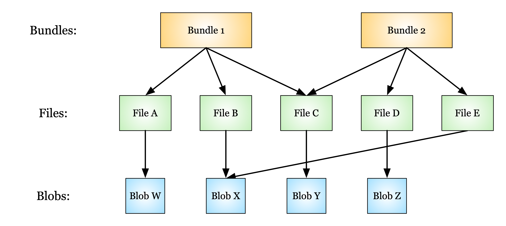

Deletion in the Data Store
--------------------------

### Definitions

**Blob**: The fundamental unit of data in the data store.

**Bundle**: A collection of related files. A bundle consists of pointers to particular files in the data store.

**Data**: In the context of the data store, "data" may refer to either files or bundles (groups of files).

**Deletion queue**: A queue of items in the data store that should be physically deleted. This queue is processed
on a regular, scheduled basis.

**File**: A pointer to a blob. Two files may point to the same blob if their contents are identical.

**Logical delete**: The process of "soft" deletion of data. Occurs by replacing the latest version of the data with
a new version. The previous version is hidden behind a deletion marker (a.k.a. a "tombstone") and is unavailable to
users through the API.

**Physical delete**: The process of "hard" deletion of data. Occurs by permanent deletion of data from the data store.

**Tombstone**: A marker used to indicate that a particular version of data has been logically deleted and superseded
by a newer version.

### DSS Data Model

Before we discuss deletion of data, we provide a summary of the data model used in the data store.

The fundamental unit of data in the data store is a blob. There is always a one-to-one correspondence between files
and blobs.

Each file in the data store is a pointer to a blob in the data store.  Two files that have different names but the
exact same content will point to the same blob.

Each bundle in the data store is a pointer to a file or group of files. It is valid for multiple bundles to share
the same file.

Users can delete or restore files and bundles using the data store API (with appropriate permissions).

Users and operators may perform deletion (logical or physical) of files and bundles using the data store API
(with appropriate permissions).

### Deletion RFC

The decision of whether to perform a logical deletion or a physical deletion should be decided using the
[deletion RFC](https://github.com/HumanCellAtlas/dcp-community/blob/master/rfcs/text/0004-dss-deletion-process.md)
in the Human Cell Atlas (HCA) project as a guide.

Users and operators requesting the deletion of files or bundles use the API and make two calls - one call to
request the deletion (which returns information about the data to be deleted), and one call to confirm deletion.
Here we cover what happens once the data store receives the confirmed deletion requests.

#### Logical Deletion

For logical deletion of files, the individual file is replaced with a tombstone marker, and future attempts to
access that version of that file will return a 410 error. 

For logical deletion of bundles, the bundle is replaced with a tombstone marker, and future attempts to access that
version of that bundle will return a 410 error.

If no version is specified for a deletion operation, all versions of the file or bundle will be tombstoned and
requests to access any version of that resource will return a 410 error.

(Note: tombstoned files are not technically considered logically deleted, since someone with a direct link to the
underlying blob in the data store can still access the data that was in the file.)

#### Physical Deletion

For physical deletion of files, the individual file is replaced with a tombstone marker (like with logical
deletion). However, the file is also added to the deletion queue, which will schedule it for permanent deletion
when the queue is next processed.

For physical deletion of bundles, the individual bundle is replaced with a tombstone marker and added to the
deletion queue. _Additionally,_ however, each file in that bundle is also tombstoned and added to the deletion
queue. 

Once a file or bundle is physically deleted, direct links to the data will become invalid.

**TODO: add info about what happens to non-deleted bundles that refer to physically deleted files (@chmreid)**

